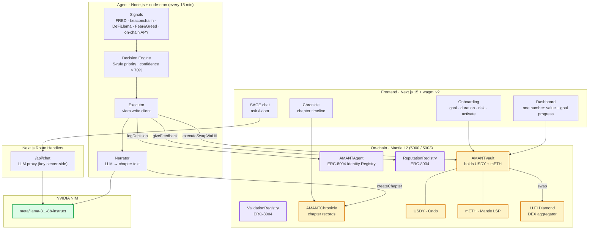
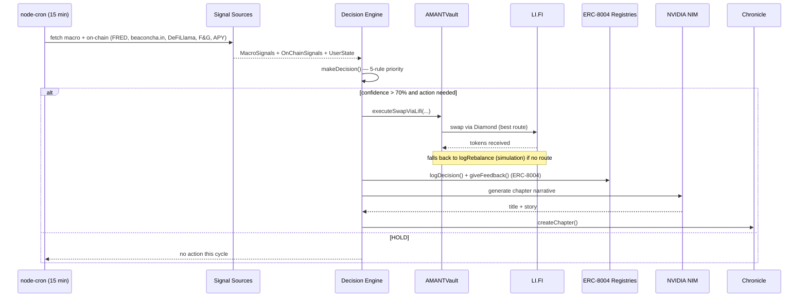
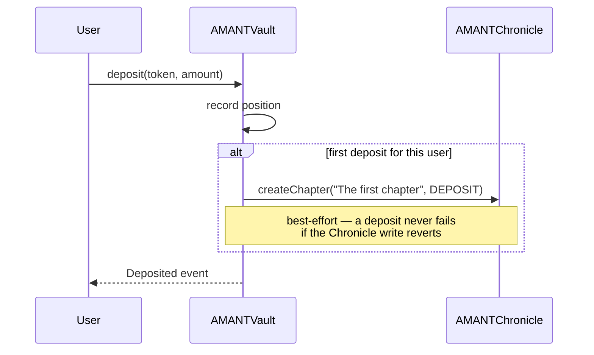
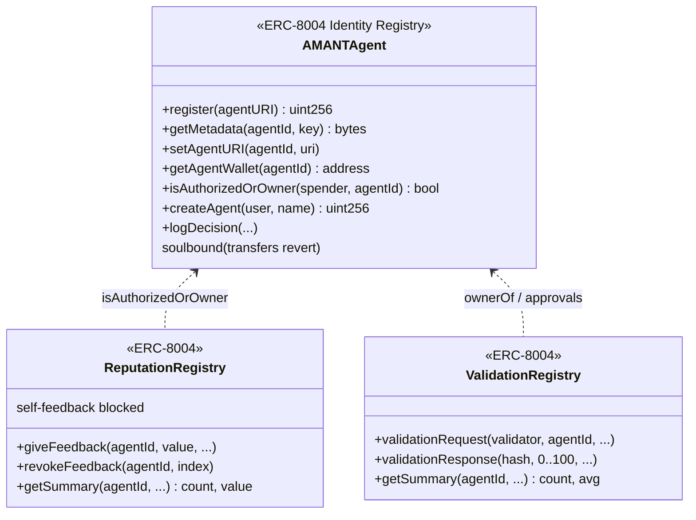
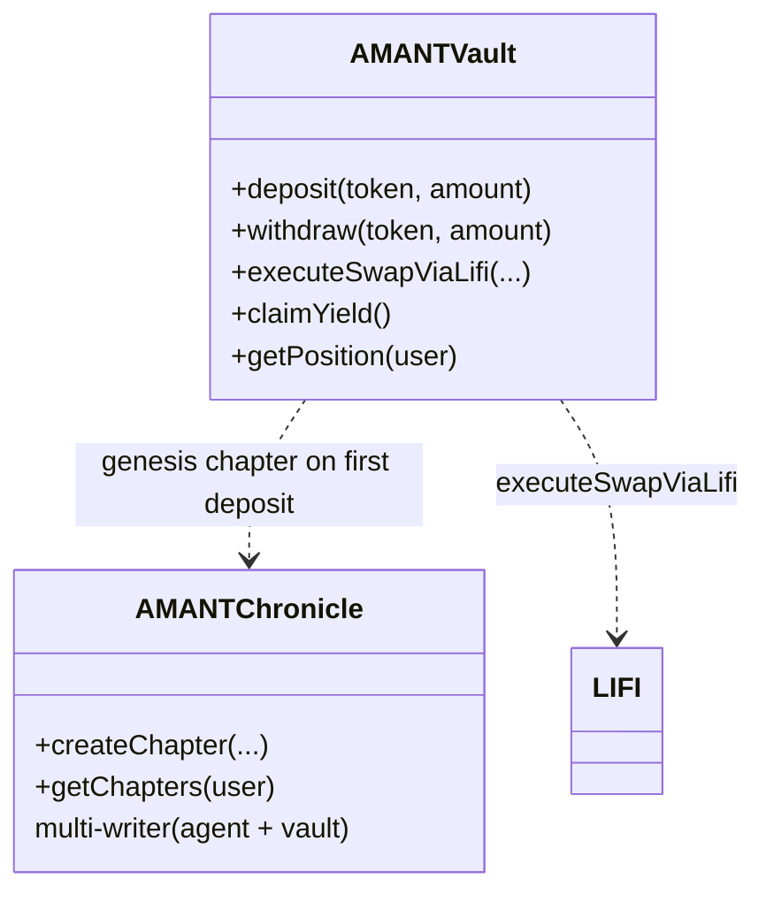

<div align="center">

# a-MANT — Autonomous AI Savings Vault on Mantle

*An AI agent that protects and grows your savings on Mantle L2 — rebalancing RWA allocations, defending against depeg events, and compounding yield, with no action required from you.*

[](https://dorahacks.io/hackathon/mantleturingtesthackathon2026/detail)
[](https://dorahacks.io/hackathon/mantleturingtesthackathon2026/detail)
[](https://www.mantle.xyz/)
[](https://eips.ethereum.org/EIPS/eip-8004)
[](#verification--tests)
[](#license)

</div>

---

## Table of Contents

- [The Problem](#the-problem)
- [The Solution](#the-solution)
- [Real-World Use Cases](#real-world-use-cases)
- [System Architecture](#system-architecture)
- [The Autonomous Loop](#the-autonomous-loop)
- [Agent Decision Rules](#agent-decision-rules)
- [Deposit → Chronicle Flow](#deposit--chronicle-flow)
- [ERC-8004 Trustless Agent Layer](#erc-8004-trustless-agent-layer)
- [Smart Contracts](#smart-contracts)
- [RWA Assets](#rwa-assets)
- [Tech Stack](#tech-stack)
- [Repository Structure](#repository-structure)
- [Getting Started](#getting-started)
- [Deployment](#deployment)
- [Verification & Tests](#verification--tests)
- [Design Principles](#design-principles)
- [Roadmap](#roadmap)
- [Feature Status](#feature-status)
- [License](#license)

---

## The Problem

People in emerging markets watch their local currency lose value every year. The on-chain world offers a fix — tokenized treasuries, liquid staking, real yield — but using it well is a full-time job:

- **Active management is required.** Yields move, stablecoins depeg, staking rates drift. Staying ahead means watching dashboards daily.
- **Jargon is a wall.** "Rebalance", "APY differential", "depeg risk" — the people who most need safe savings are the least served by DeFi UX.
- **Most "AI" crypto products are chatbots with a wallet.** They *talk* about your portfolio; they don't *act* on it.

The net effect: **safe, inflation-beating yield exists on-chain, but only for people with the time and expertise to manage it manually.**

## The Solution

**a-MANT** is an autonomous AI savings vault. You deposit USDY or mETH, set a goal, and the AI does everything else.

- ✅ **Deposit USDY or mETH** into a non-custodial vault on Mantle L2.
- ✅ **Set a goal** (amount, duration, risk mode) — that's the last decision you make.
- ✅ **The AI acts on-chain, autonomously.** A server-side agent monitors macro + on-chain signals every 15 minutes and executes real rebalancing transactions when its confidence exceeds 70%.
- ✅ **Real swaps via LI.FI.** Rebalances route through the LI.FI Diamond aggregator for best execution.
- ✅ **Every decision becomes a "chapter."** The Chronicle turns each AI action into a plain-language story you can actually read — no raw logs.
- ✅ **The agent has a verifiable on-chain identity.** Agent identity, reputation, and validation follow the **ERC-8004 "Trustless Agents"** standard.
- ✅ **Ask Axiom anything.** SAGE is a chat window into what the AI has already done.

> **Key insight:** a-MANT is **not a chatbot with a wallet.** The AI executes real transactions; the chat and dashboard are windows into decisions it has already made. *AI acts — you observe.*

## Real-World Use Cases

| Use Case | Why Autonomy Matters |
| --- | --- |
| **Savers in high-inflation economies** | Need yield that beats local inflation without becoming a DeFi expert. |
| **Busy professionals** | Want savings that rebalance themselves while they ignore the market. |
| **Crypto newcomers** | Can't tell a depeg from a dip; the agent protects them automatically. |
| **Long-horizon goal savers** | Set a target (e.g. $10k in 24 months) and let the agent steer toward it. |
| **The privacy of not-watching** | Removing the human from the loop removes emotional, panic-driven decisions. |

In every case, the user sets a goal once; the agent does the continuous work.

---

## System Architecture



- **LLM key is never shipped to the browser** — SAGE chat and the narrator both call NVIDIA NIM through a server-side route / the agent process.

## The Autonomous Loop

Every 15 minutes, for each monitored user, the agent runs one cycle end to end:



## Agent Decision Rules

The decision engine (`agent/src/engine/decision.ts`) evaluates rules in **priority order** and acts only when confidence exceeds 70%:

1. **Ondo health score < 80** → `PROTECT`: move all mETH to USDY.
2. **Volatility > 70** AND user in SAFE mode → `PROTECT`.
3. **ETH staking rate trending down** AND < 3.0% → `REBALANCE` mETH → USDY.
4. **Fed rate trending down** AND < 4.0% AND risk mode ≥ BALANCED → `REBALANCE` USDY → mETH.
5. **APY differential > 1.5%** → `REBALANCE` 35% toward the better-yielding asset.
6. **Default** → `HOLD`.

## Deposit → Chronicle Flow

A user's Chronicle begins the moment they make their first deposit — the vault writes a genesis chapter on-chain:



From then on, every autonomous decision the agent takes appends another chapter.

## ERC-8004 Trustless Agent Layer

a-MANT implements the three [ERC-8004 "Trustless Agents"](https://eips.ethereum.org/EIPS/eip-8004) registries (non-upgradeable ports of the official reference, adapted to OpenZeppelin v5.2 / Solidity 0.8.24):



| Registry | Contract | Role |
| --- | --- | --- |
| **Identity** | `AMANTAgent` | ERC-721 agent identity with an AgentCard `tokenURI`, arbitrary key→value metadata (reserved `agentWallet`), and the `isAuthorizedOrOwner` hook. Soulbound (an agent is bound to its guardian — an intentional a-MANT policy). |
| **Reputation** | `ReputationRegistry` | Independent clients publish bounded, tagged feedback signals. Agent owners/operators cannot self-rate. The autonomous executor publishes an outcome signal per executed decision. |
| **Validation** | `ValidationRegistry` | Validators attest (score 0–100) that an agent's work was independently checked. |

> ERC-8004 compliance is **verified by tests** (`contract/test/erc8004.test.ts`).

## Smart Contracts



| Contract | Responsibility | Standard |
| --- | --- | --- |
| `AMANTVault.sol` | Holds USDY + mETH, deposit / withdraw / rebalance, swaps via LI.FI, writes the genesis chapter on first deposit. | — |
| `AMANTAgent.sol` | **ERC-8004 Identity Registry** + a-MANT decision journal & impact reputation. Soulbound. | ERC-8004 / ERC-721 |
| `ReputationRegistry.sol` | **ERC-8004 Reputation Registry** — client feedback signals. | ERC-8004 |
| `ValidationRegistry.sol` | **ERC-8004 Validation Registry** — validator attestations. | ERC-8004 |
| `AMANTChronicle.sol` | Per-user chapter records + milestone NFTs. | ERC-721 |
| `AMANTVaultTestnet.sol` | Testnet vault accepting any two ERC-20s (mock USDY/mETH). | — |
| `MockERC20.sol` | Mintable mock token for testnet. | ERC-20 |

The deploy script branches on chainId: **5003 → testnet** (deploys mock tokens + `AMANTVaultTestnet`), **otherwise mainnet** (real USDY/mETH + `AMANTVault` + `vault.setLifiDiamond`). It deploys all three ERC-8004 registries (Reputation + Validation point at `AMANTAgent` as the identity registry) and wires everything together.

## RWA Assets

| Token | Description | APY (approx) | Address (Mantle mainnet) |
| --- | --- | --- | --- |
| **USDY** | Ondo Finance — US Treasury-backed, tokenized | ~4.5% | `0x5bE26527e817998A7206475496fDE1E68957c5A6` |
| **mETH** | Mantle Liquid Staking Token | ~3.8% | `0xcDA86A272531e8640cD7F1a92c01839911B90bb0` |

> USDY is the RWA anchor (tokenized US Treasuries); mETH adds liquid-staking yield. On **testnet**, both are replaced by mintable `MockERC20` tokens.

---

## Tech Stack

```text
Smart Contracts ┃ Solidity 0.8.24, Hardhat, OpenZeppelin v5.2, ERC-8004 registries
                ┃ optimizer (200 runs), evmVersion cancun, viaIR
Agent           ┃ Node.js + TypeScript, viem write client, node-cron (15-min loop)
                ┃ LI.FI quote API (li.quest), FRED / beaconcha.in / DeFiLlama / alternative.me
AI              ┃ NVIDIA NIM — meta/llama-3.1-8b-instruct (narrator + SAGE chat)
Frontend        ┃ Next.js 15, React 19, TypeScript, wagmi v2, viem
                ┃ Tailwind CSS, Manrope font, Framer Motion, Zustand
Web3            ┃ Mantle L2 — chain id 5000 (mainnet) / 5003 (Sepolia testnet)
Tooling         ┃ pnpm workspace, Hardhat tests (13 passing)
```

## Repository Structure

```text
a-mant/
├── web/                          # Next.js 15 frontend
│   └── src/
│       ├── app/
│       │   ├── page.tsx              # Landing
│       │   ├── onboard/              # 5-step onboarding
│       │   ├── app/page.tsx          # Dashboard
│       │   ├── app/chronicle/        # Chapter timeline
│       │   ├── app/chat/             # SAGE chat
│       │   └── api/chat/route.ts     # LLM proxy (NVIDIA NIM)
│       ├── hooks/                # useVault, useAgent, useChapters
│       ├── lib/contracts.ts      # addresses + ABIs (incl. ERC-8004 registries)
│       ├── store/               # Zustand onboarding state
│       └── types/
│
├── contract/                     # Hardhat — Solidity
│   ├── contracts/
│   │   ├── AMANTVault.sol            # + AMANTVaultTestnet.sol, MockERC20.sol
│   │   ├── AMANTAgent.sol            # ERC-8004 Identity Registry
│   │   ├── ReputationRegistry.sol    # ERC-8004
│   │   ├── ValidationRegistry.sol    # ERC-8004
│   │   └── AMANTChronicle.sol
│   ├── scripts/deploy.ts         # testnet/mainnet branching + wiring
│   └── test/                     # erc8004.test.ts, chronicle-genesis.test.ts
│
└── agent/                        # Node.js autonomous agent
    └── src/
        ├── signals/                 # macro.ts, onchain.ts
        ├── engine/decision.ts       # 5-rule decision engine
        ├── executor/                # index.ts (viem) + lifi.ts (quote)
        ├── narrator/index.ts        # LLM → chapter narrative
        └── index.ts                 # node-cron loop
```

---

## Getting Started

### Prerequisites

- Node.js ≥ 20, pnpm ≥ 9
- A wallet funded with Mantle Sepolia MNT ([faucet](https://faucet.sepolia.mantle.xyz))
- A [FRED API key](https://fred.stlouisfed.org/docs/api/api_key.html) (free) and an [NVIDIA NIM API key](https://build.nvidia.com/)

### 1. Clone & Install

```bash
git clone <repo-url> a-mant
cd a-mant
cp .env.example .env
pnpm install            # installs all workspaces (run from root)
```

Fill `.env` (see `.env.example`): `PRIVATE_KEY`, `NVIDIA_API_KEY`, `FRED_API_KEY`, and the `NEXT_PUBLIC_*` contract addresses (filled after deploy).

### 2. Compile & Test Contracts

```bash
pnpm build:contract     # hardhat compile
pnpm test:contract      # 13 tests — ERC-8004 compliance + genesis chapter
```

### 3. Run the Frontend

```bash
pnpm dev:web            # → http://localhost:3000
```

### 4. Run the Agent (one process, 15-min loop)

```bash
cp .env agent/.env      # the agent reads its own .env
pnpm dev:agent          # tsx watch — runs a cycle immediately, then every 15 min
```

Set `MONITORED_USERS=0xADDR1,0xADDR2` in the agent env to choose which vault depositors it watches.

---

## Deployment

The deploy script auto-detects the network by chainId.

### Testnet (Mantle Sepolia, chainId 5003)

```bash
# 1. Fund the deployer wallet with testnet MNT
pnpm --filter contract deploy:testnet
# 2. Copy the printed NEXT_PUBLIC_* addresses into .env, then rebuild web
```

Deploys mock USDY/mETH + `AMANTVaultTestnet`, all ERC-8004 registries, and the Chronicle; authorizes the vault as a Chronicle writer (for genesis chapters).

### Mainnet (Mantle, chainId 5000)

```bash
pnpm deploy:contract
```

Uses the real USDY/mETH addresses, deploys `AMANTVault`, and configures the LI.FI Diamond (`vault.setLifiDiamond`).

> `NEXT_PUBLIC_*` vars are inlined at build time — changing addresses requires rebuilding the web app.

---

## Verification & Tests

There is no mock data path in the contract tests — they exercise real contract logic on Hardhat's in-process EVM.

```bash
pnpm test:contract
```

```text
  Chronicle genesis chapter on first deposit
    ✔ creates exactly one DEPOSIT chapter on the first deposit
    ✔ does not write another genesis chapter on subsequent deposits
    ✔ still lets a deposit succeed if the Chronicle is not configured
  ERC-8004 registries
    Identity Registry (AMANTAgent)
      ✔ registers an agent and exposes the reserved agentWallet metadata
      ✔ emits Registered on register(agentURI) and stores the AgentCard URI
      ✔ lets the owner set metadata but protects the reserved key
      ✔ isAuthorizedOrOwner reflects ownership
      ✔ is soulbound — transfers revert
    Reputation Registry
      ✔ accepts client feedback and aggregates a summary
      ✔ blocks self-feedback from the agent owner
      ✔ supports revoking feedback
    Validation Registry
      ✔ records a validation request from the owner and a validator response
      ✔ rejects a validation request from a non-owner

  13 passing
```

Verify the rest of the stack:

```bash
pnpm build:web                  # Next.js production build
pnpm --filter agent build       # tsc typecheck of the agent
```

---

## Design Principles

- **AI acts, you observe.** The app surfaces what the AI decided — not a menu of options to click.
- **One number matters.** The dashboard leads with total value + goal progress, not APY tables.
- **No jargon on the surface.** "Rebalance" and "yield" live in the detail layer, never the primary UI.
- **A stack you can verify.** Real LI.FI routing, real ERC-8004 registries, real on-chain chapters — backed by tests.
- **Dark, premium, minimal.** Background `#0a0a0f`, accent `#ffefc5`, Manrope font. No emoji, no decorative gradients.

---

## Roadmap

**Hackathon scope (delivered):**

- [x] Non-custodial vault for USDY + mETH on Mantle
- [x] Autonomous agent: signals → 5-rule decision engine → on-chain execution (15-min loop)
- [x] Real rebalancing swaps via the LI.FI Diamond aggregator (mainnet), with simulation fallback
- [x] ERC-8004 Identity + Reputation + Validation registries (tested)
- [x] Chronicle: genesis chapter on first deposit + AI-narrated chapters per decision
- [x] LLM narrator + SAGE chat (NVIDIA NIM)
- [x] Next.js 15 frontend: onboarding · dashboard · chronicle · chat

**Post-hackathon:**

- [ ] Mainnet launch with live USDY/mETH positions
- [ ] On-chain validator network for ERC-8004 validation responses
- [ ] Surface ERC-8004 reputation/validation scores in the dashboard
- [ ] AgentCard (`tokenURI`) hosting + discovery
- [ ] More RWA assets and vault strategies
- [ ] Persisted multi-user registry (replace `MONITORED_USERS` env)

---

## Feature Status

| Feature | Status | Notes |
| --- | --- | --- |
| Deposit USDY/mETH into vault | ✅ | Non-custodial; genesis chapter on first deposit |
| Autonomous 15-min decision loop | ✅ | `node-cron`, multi-user, error-isolated |
| 5-rule decision engine (confidence > 70%) | ✅ | `agent/src/engine/decision.ts` |
| Real swap via LI.FI | ✅ Mainnet | Quote from `li.quest`; falls back to simulation on testnet / no route |
| ERC-8004 Identity / Reputation / Validation | ✅ | Tested in `contract/test/erc8004.test.ts` |
| Chronicle chapters (genesis + AI-narrated) | ✅ | Vault + agent both authorized writers |
| LLM narrator + SAGE chat | ✅ | NVIDIA NIM `meta/llama-3.1-8b-instruct`, key server-side |
| Frontend (onboard · dashboard · chronicle · chat) | ✅ | Next.js 15 + wagmi v2 |
| Live mainnet deployment | ⏳ | Testnet flow uses mock tokens + simulated rebalances |

---

## License

MIT © 2026 a-MANT contributors.
